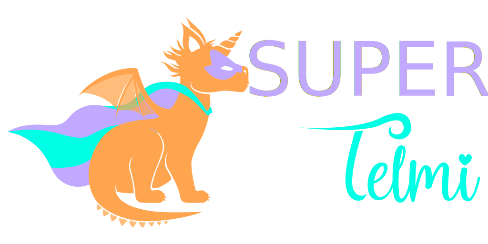

# Super Telmi, la super machine pour Telmi

## Qu’est-ce que la Super Telmi ?

La Super Telmi est une boîte à histoires Open-Source conçue pour émerveiller les enfants, basée sur le système libre [Telmi](https://telmi.fr).

Elle s’appuie sur la console Miyoo, reconnue pour sa simplicité, son prix abordable et sa robustesse, idéale pour les réparations et les améliorations.

Des parents passionnés ont imaginé et testé des améliorations pour offrir le meilleur à leurs enfants. 

La Super Telmi rassemble ces innovations et les retours d’expérience concrets des enfants, pour une expérience toujours plus enrichissante.

🎬 [Voir la vidéo de présentation de la Super Telmi](https://www.youtube.com/watch?v=lRGE3fMTku0)

## Comment se la procurer ?

La Super Telmi est accessible à tous :

* Fabriquez-la vous-même : les plans et manuels de fabrication [sont disponibles ici](./diy/DIY_FR.md).
* Achetez-la prête à l’emploi : **(PROCHAINEMENT)**

## Contribuer

La Super-Telmi à pour vocation d'être en constante amélioration grâce aux idées des parents et enfants. 
Il est possible d'apporter votre contribution en [rejoignant le Discord de la communauté Telmi](https://discord.gg/ZTA5FyERbg).

---

# Super Telmi, the super machine for Telmi

## What is Super Telmi?

Super Telmi is an open-source story box designed to amaze children, based on the free [Telmi](https://telmi.fr) system.

It uses the Miyoo console, known for its simplicity, affordability, and robustness, making it ideal for repairs and upgrades.

Passionate parents have imagined and tested improvements to offer the best for their children.

Super Telmi combines these innovations with real-life feedback from children, for an even more enriching experience.

## How to get it?

Super Telmi is accessible to everyone:

* Do it yourself: plans and manuals [are available here](./diy/DIY_EN.md).
* Buy it ready-made: [available in this Etsy shop](https://www.etsy.com/fr/shop/heuzef).

## Contribute

Super Telmi aims to be constantly improved thanks to the ideas of parents and children. 
You can contribute [by joining the Telmi community Discord](https://discord.gg/ZTA5FyERbg).