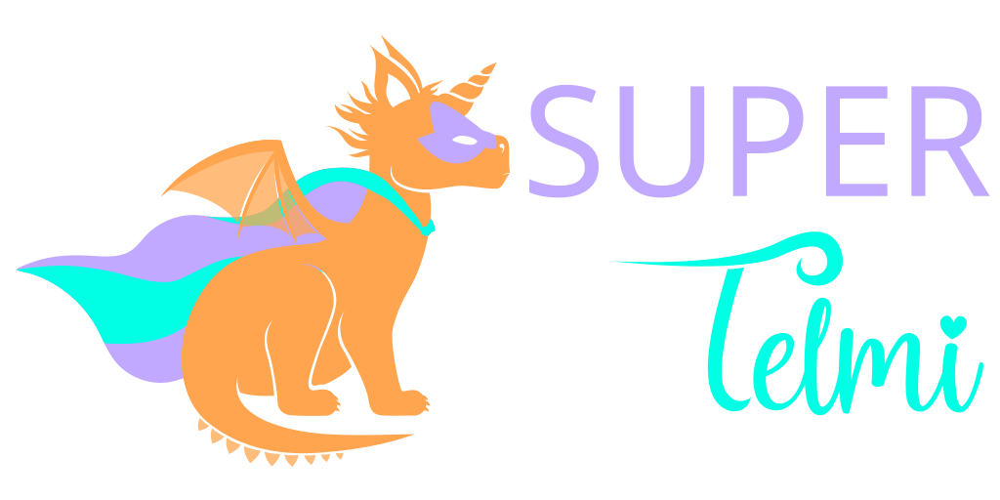

**Choisissez votre langue · Choose your language**

---

<b>&nbsp;🇫🇷&nbsp; Français</b>

 

# Super Telmi, la super machine pour Telmi

## Qu’est-ce que la Super Telmi ?

La Super Telmi est une boîte à histoires Open-Source conçue pour émerveiller les enfants, basée sur le système libre [Telmi](https://telmi.fr).

Elle s’appuie sur la console Miyoo, reconnue pour sa simplicité, son prix abordable et sa robustesse, idéale pour les réparations et les améliorations.

Des parents passionnés ont imaginé et testé des améliorations pour offrir le meilleur à leurs enfants.

La Super Telmi rassemble ces innovations et les retours d’expérience concrets des enfants, pour une expérience toujours plus enrichissante.

🎬 [Voir la vidéo de présentation de la Super Telmi](https://www.youtube.com/watch?v=lRGE3fMTku0)

## Qu’apporte-t-elle de plus ?

* 🔊 **Un vrai haut-parleur de 40 mm**, à la place du minuscule composant d’origine à la qualité sonore décevante.
* 🛡️ **Une coque imprimée en TPU souple**, qui encaisse les chocs, les chutes et les crises de colère.
* 🧲 **Une station d’accueil magnétique**, pour recharger l’appareil d’un simple geste, sans manipuler de connecteur.
* ✂️ **Une simplification du matériel** : les gâchettes, inutiles pour Telmi, sont supprimées.

## Comment se la procurer ?

La Super Telmi est accessible à tous : fabriquez-la vous-même ! Les plans et manuels de fabrication [sont disponibles ici](./diy/DIY_FR.md).

À prévoir pour une fabrication maison : une Miyoo Mini Plus, du matériel de soudure, une imprimante 3D et quelques composants détaillés dans le guide. Comptez environ **20 heures d’impression** au total (≈ 9 h pour la coque, ≈ 10 h pour la station d’accueil).

## Contenu du dépôt

| Dossier | Contenu |
| --- | --- |
| [`diy/`](./diy/) | Les guides de fabrication pas à pas, en [français](./diy/DIY_FR.md) et en [anglais](./diy/DIY_EN.md). |
| [`files/`](./files/) | Les fichiers 3D : sources CAO (`.f3d`, `.step`), modèles `.3mf`, et fichiers prêts à imprimer pour certaines imprimantes. |

## Contribuer

La Super Telmi a pour vocation d'être en constante amélioration grâce aux idées des parents et enfants.
Il est possible d'apporter votre contribution en [rejoignant le Discord de la communauté Telmi](https://discord.gg/ZTA5FyERbg).

> Les guides existent en deux langues : toute modification apportée à [`DIY_FR.md`](./diy/DIY_FR.md) doit être répercutée dans [`DIY_EN.md`](./diy/DIY_EN.md), et inversement.

## Licence

Ce projet est publié sous licence **[CC BY-NC-SA 4.0](./LICENCE.md)** : partage et modifications libres avec attribution, mais **usage commercial interdit sans autorisation préalable**.

<b>&nbsp;🇬🇧&nbsp; English</b>

 

# Super Telmi, the super machine for Telmi

## What is Super Telmi?

Super Telmi is an open-source story box designed to amaze children, based on the free [Telmi](https://telmi.fr) system.

It uses the Miyoo console, known for its simplicity, affordability, and robustness, making it ideal for repairs and upgrades.

Passionate parents have imagined and tested improvements to offer the best for their children.

Super Telmi combines these innovations with real-life feedback from children, for an even more enriching experience.

🎬 [Watch the Super Telmi presentation video](https://www.youtube.com/watch?v=lRGE3fMTku0) (in French)

## What does it add?

* 🔊 **A real 40 mm speaker**, replacing the tiny original component and its disappointing sound quality.
* 🛡️ **A flexible TPU-printed shell**, which absorbs knocks, drops and temper tantrums.
* 🧲 **A magnetic docking station**, to charge the device in a single gesture, with no connector to fiddle with.
* ✂️ **Simplified hardware**: the triggers, useless for Telmi, are removed.

## How to get it?

Super Telmi is accessible to everyone: do it yourself! Plans and manuals [are available here](./diy/DIY_EN.md).

What you need for a home build: a Miyoo Mini Plus, soldering equipment, a 3D printer and a few components detailed in the guide. Expect around **20 hours of printing** in total (~9h for the shell, ~10h for the docking station).

## Repository contents

| Folder | Contents |
| --- | --- |
| [`diy/`](./diy/) | The step-by-step build guides, in [French](./diy/DIY_FR.md) and [English](./diy/DIY_EN.md). |
| [`files/`](./files/) | The 3D files: CAD sources (`.f3d`, `.step`), `.3mf` models, and ready-to-print files for some printers. |

## Contribute

Super Telmi aims to be constantly improved thanks to the ideas of parents and children.
You can contribute [by joining the Telmi community Discord](https://discord.gg/ZTA5FyERbg).

> The guides exist in two languages: any change made to [`DIY_EN.md`](./diy/DIY_EN.md) must be mirrored in [`DIY_FR.md`](./diy/DIY_FR.md), and vice versa.

## Licence

This project is released under the **[CC BY-NC-SA 4.0](./LICENCE.md)** licence: sharing and modifications are free with attribution, but **commercial use is forbidden without prior permission**.

