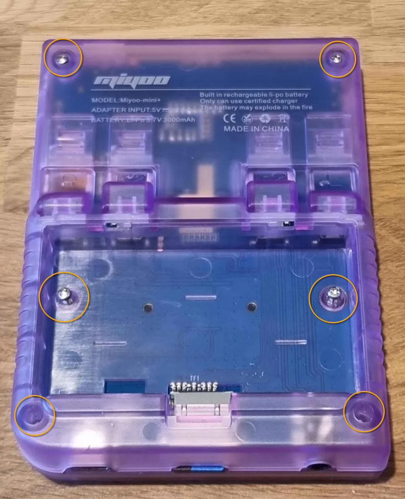
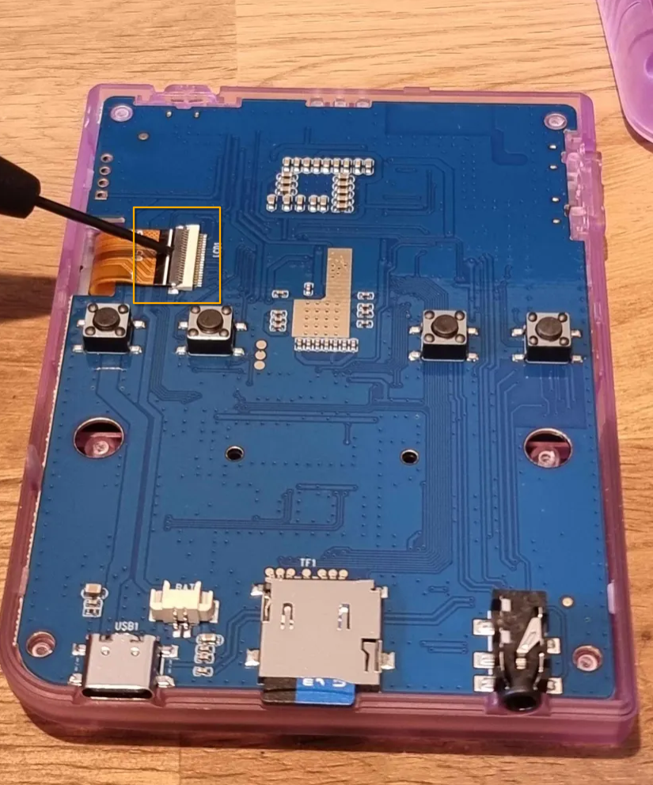
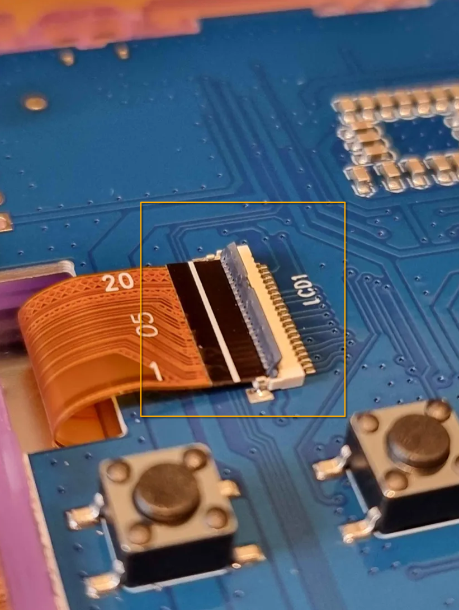
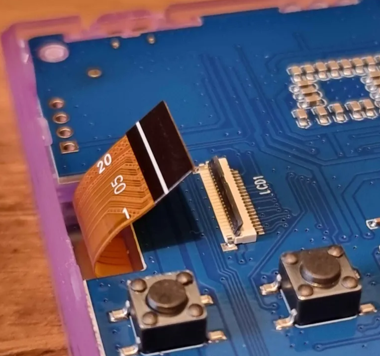
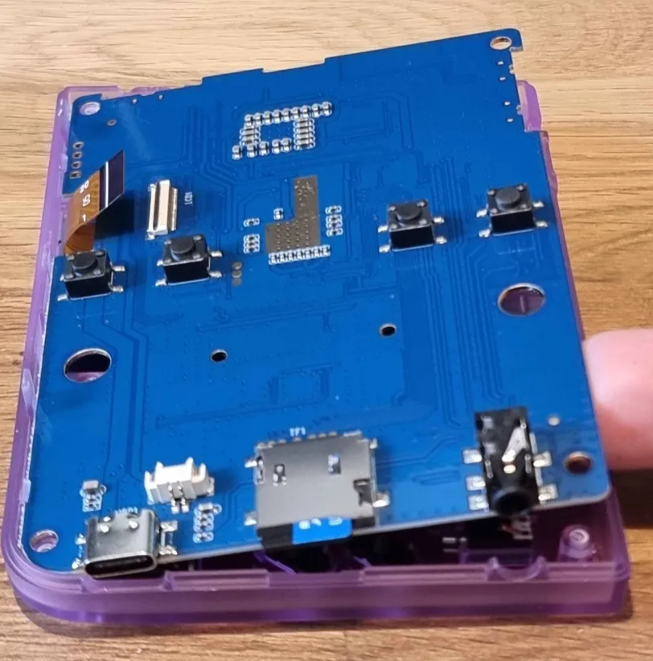
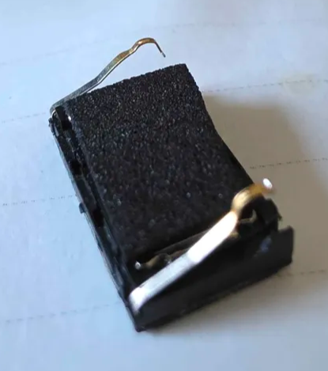

Bienvenue dans le guide de fabrication de la Super-Telmi, vous vous apprêtez à offrir à vos enfants ce qui existe de mieux en matière de boîte à histoire, non seulement par l'amour que vous mettrez à lui concevoir ce beau cadeau, mais aussi par la très forte résilience qui vous est offerte ici sur la partie matériel, ainsi que le potentiel illimité offert par Telmi.

# Matériel requis

* Équipement pour soudure électronique
* Imprimante 3D
* [Une Miyoo Mini Plus](https://wiki.telmi.fr/achats/miyoo_mini_plus)
* Pistolet à colle chaude 

# Achats à prévoir
* [Haut parleur 40mm 8ohms 3W](https://fr.aliexpress.com/item/1005002679785627.html)
* [Fil électriques](https://fr.aliexpress.com/item/1005005450270866.html)
* [Contact de compression à ressort 16mm 8 pin mâle (BC-12-8P)](https://fr.aliexpress.com/item/4000282372452.html)
* [Boulonnerie M2 et M3](https://fr.aliexpress.com/item/1005007159750547.html)
* [Bobine de filament TPU 250G](https://fr.aliexpress.com/item/1005007707597137.html)
* [Câble avec embout USB-C magnétique](https://fr.aliexpress.com/item/1005009401790316.html)
* [4 aimants néodymes rond 10X3mm](https://fr.aliexpress.com/item/1005009749865836.html)
* [Colle cyanoacrylate](https://fr.aliexpress.com/item/1005008517608338.html)
* [Colliers de serrage](https://fr.aliexpress.com/item/1005009405351665.html)

# Fabrication

N'hésitez pas à rencontrer la communauté sur Discord avant de vous lancer dans la fabrication !

Vos retours d'expériences sont précieux pour permettre l'amélioration continue de ce projet.

## Impression 3D des pièces

Les fichiers 3D sont disponibles [ICI](../files/) et doivent être imprimés avec du TPU. 

Pour la coque principal, il est recommandé d'avoir un remplissage d'au moins 25% à 30% pour s'assurer que la Super Telmi soit la plus résistante possible au chocs, chutes, crise de colère ou tout utilisation abusive détournée pour violenter la fraterie.

Un remplissage plus important risquerait de rendre la coque trop solide, absorbant alors moins efficacement les chocs.

## Démontage de la Miyoo

La première action est de retirer la batterie, via la petite trappe à l'arrière de la Miyoo.
Cette dernière est assez simple à enlever a l'aide d'une petite pince, retirer doucement le connecteur 2 Pins.

Commençons le démontage de la coque arrière de la Miyoo. Vous aller pouvoir repérer 6 petites vis M2.

Une fois enlevés, retirer la coque (avec un effet levier) tout doucement, cette dernière ne vous sera plus utile.

L'écran est maintenu par une nappe, il vous faut la déconnecter. Pour cela, repérer la petite ligne blanche sur la carte mère et proceder à un déverrouillage par effet de levier. Puis sortir délicatement la nappe pour débrancher l'écran.

À présent, sortir toutes les petites pièces de la Miyoo pour en prendre connaissance et vous familiariser avec :

* Les boutons
* Les croix directionnels et leur supports en  silicone
* Les déclencheurs (qui ne seront plus utilisés car inutile pour Telmi)
* Et enfin les boutons de contrôle d'allumage et de volume (qui ne tiennent pas à grand chose comme vous aller le constater)

Mettre tout ceci de côté soigneusement.

## Préparation du Haut-Parleur

Il est temps de retirer le Haut-Parleur, situé en bas à droite, ce petit composant offre une bien piètre qualitée sonore. Ce dernier effectue via ses deux pattes un simple contact par pression sur la carte mère, c'est ce que nous allons reproduire avec notre haut parleur de 40mm.

En cours de rédaction ...

## Montage de la Super-Telmi

En cours de rédaction ...

## Fabrication de la station d'accueil

Une fois votre station imprimé et nettoyée. Vous pouvez appliquer une goutte (pas plus) de colle cyanoacrylate dans chaque trou prévu pour l'accueil des aiments néodymes. 

> Vérifiez bien la polarité, le sens est important, avant des les scellers définitivement.

À présent, insérer un boulon M3 de XXmm depuis l'arrière de la station dans le trou prévu à cet effet. 

Ce dernier en place, insérer un petit collier de serrage autour que vous pouvez pré-fermer, en laissant juste assez ouvert pour passer la tête du câble USB-C et embout aimant.

Une fois la position idéale bien mesurée avec la Super-Telmi, serez fermement le collier de serrage pour maintenir la position du câble et son embout aimanté définitivement en place.

Coupez l'excédent du collier avec une pince coupante, puis glissez le câble USB le lobg de la fente prévu à cet effet.

Félicitations, vous avez terminé la Super-Telmi. Il ne reste plus qu'à emballer pour offrir 🎁