<!-- Ce guide existe en plusieurs langues. Toute modification apportée ici doit être répercutée dans DIY_EN.md, DIY_ES.md et DIY_ZH.md. -->

Bienvenue dans le guide de fabrication de la Super Telmi, vous vous apprêtez à offrir à vos enfants ce qui existe de mieux en matière de boîte à histoires, non seulement par l'amour que vous mettrez à leur concevoir ce beau cadeau, mais aussi par la très forte résilience qui vous est offerte ici sur le matériel, ainsi que le potentiel illimité offert par Telmi.

# Matériel requis

* Équipement de soudure électronique
* Imprimante 3D
* [Une Miyoo Mini Plus](https://wiki.telmi.fr/achats/miyoo_mini_plus)

# Achats à prévoir
* [Haut-parleur 40 mm 8 ohms 3 W](https://fr.aliexpress.com/item/1005002679785627.html)
* [Fils électriques](https://fr.aliexpress.com/item/1005005450270866.html)
* [Vis et écrous M2 et M3](https://fr.aliexpress.com/item/1005007159750547.html)
* [Bobine de filament TPU 250 g](https://fr.aliexpress.com/item/1005007707597137.html)
* [Câble avec embout USB-C magnétique](https://fr.aliexpress.com/item/1005009401790316.html)
* [4 aimants néodyme ronds 10x3 mm](https://fr.aliexpress.com/item/1005009749865836.html)
* [Colle cyanoacrylate](https://fr.aliexpress.com/item/1005008517608338.html)
* [Colliers de serrage](https://fr.aliexpress.com/item/1005009405351665.html)

# Fabrication

N'hésitez pas à rencontrer la communauté sur [Discord](https://discord.gg/ZTA5FyERbg) avant de vous lancer dans la fabrication !

Vos retours d'expérience sont précieux pour permettre l'amélioration continue de ce projet.

## Impression 3D des pièces

Les fichiers 3D sont disponibles [ICI](../files/) et doivent être imprimés avec du TPU pour l'absorption des chocs.

Pour la coque principale, il est recommandé d'avoir un remplissage d'au moins 25 % à 30 % pour s'assurer que la Super Telmi soit la plus résistante possible aux chocs, chutes, crises de colère ou toute utilisation abusive détournée pour violenter la fratrie.

Un remplissage plus important risquerait de rendre la coque trop solide, absorbant alors moins efficacement les chocs.

## Démontage de la Miyoo

La première action est de retirer la batterie, via la petite trappe à l'arrière de la Miyoo.
Cette dernière est assez simple à enlever à l'aide d'une petite pince, retirez doucement le connecteur 2 pins.

Commençons le démontage de la coque arrière de la Miyoo. Vous allez pouvoir repérer 6 petites vis M2.

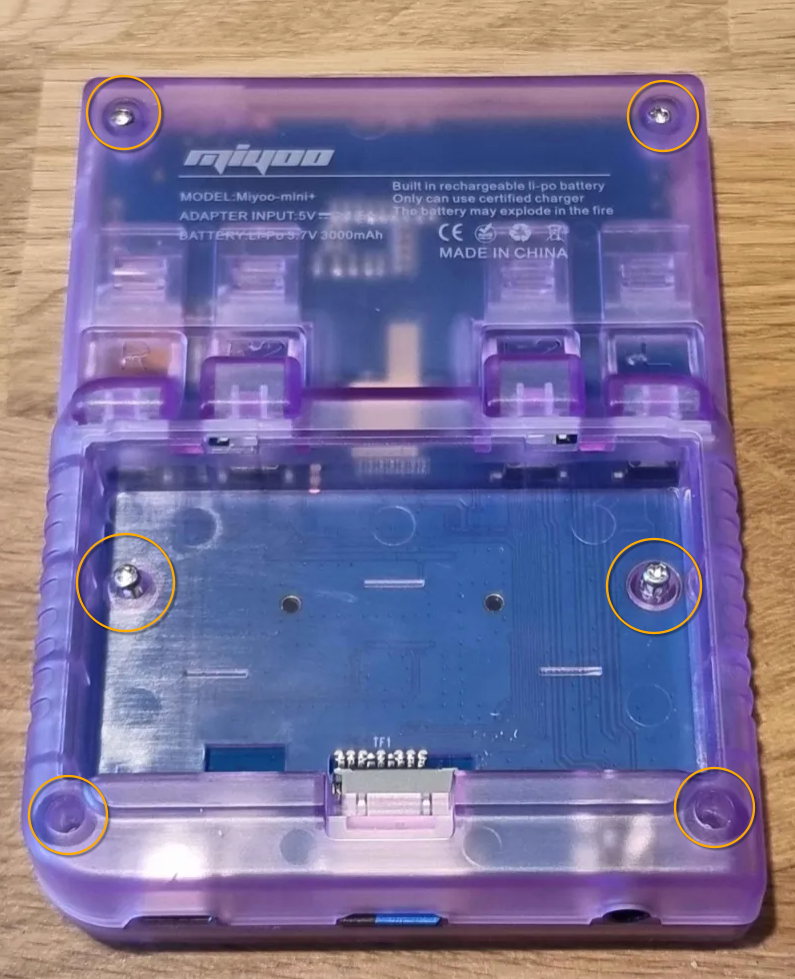

Une fois enlevées, retirez la coque (avec un effet de levier) tout doucement, cette dernière ne vous sera plus utile.

L'écran est maintenu par une nappe, il vous faut la déconnecter. Pour cela, repérez la petite ligne blanche sur la carte mère et procédez à un déverrouillage par effet de levier. Puis sortez délicatement la nappe pour débrancher l'écran.

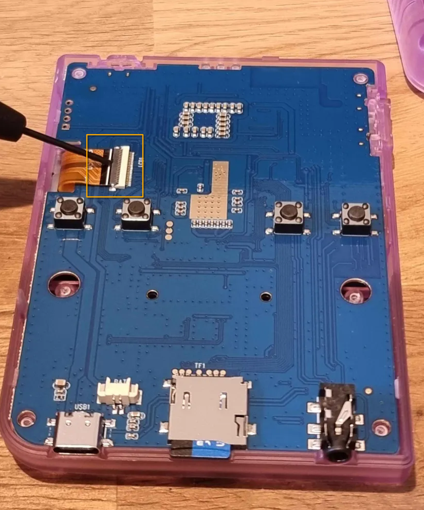

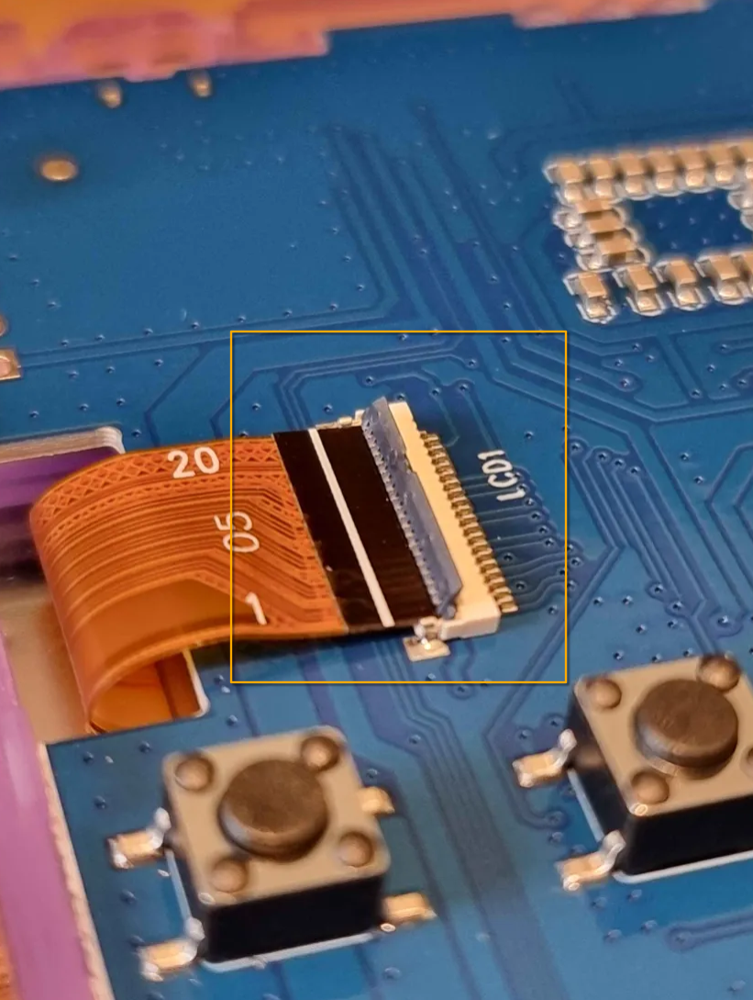

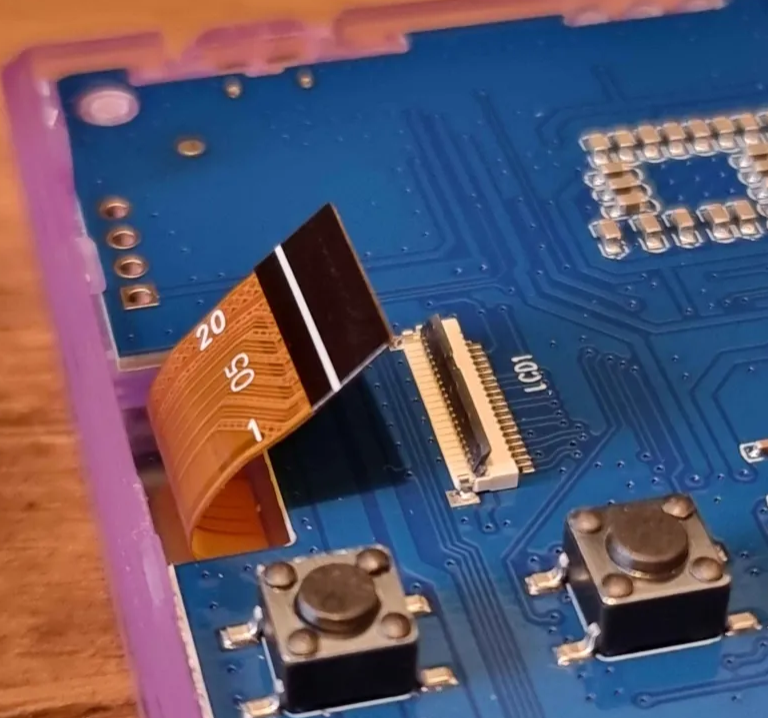

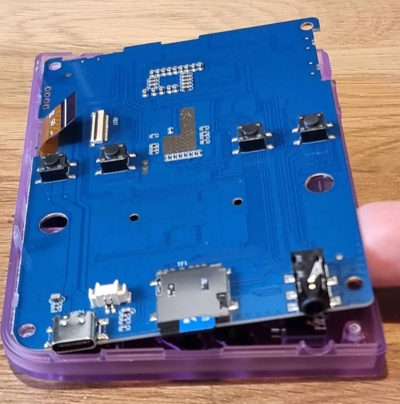

À présent, sortez toutes les petites pièces de la Miyoo pour en prendre connaissance et vous familiariser avec :

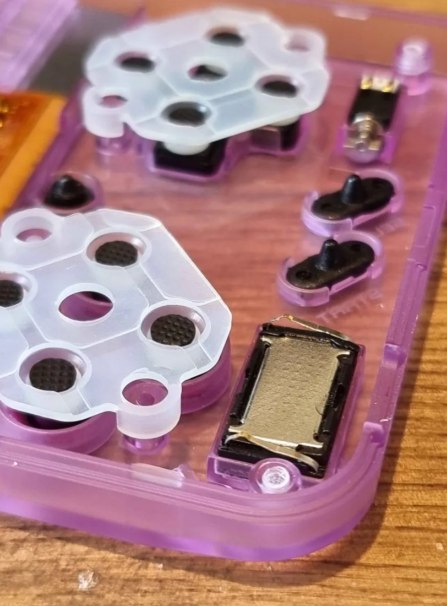

* Les boutons
* Les croix directionnelles et leurs supports en silicone
* Les gâchettes (qui ne seront plus utilisées car inutiles pour Telmi)
* Et enfin les boutons de contrôle d'allumage et de volume (qui ne tiennent pas à grand-chose comme vous allez le constater)

Mettez tout ceci de côté soigneusement.

## Préparation du haut-parleur

Il est temps de retirer le haut-parleur, situé en bas à droite, ce petit composant offre une bien piètre qualité sonore. Ce dernier effectue via ses deux pattes un simple contact par pression sur la carte mère, c'est ce que nous allons reproduire avec notre haut-parleur de 40 mm.

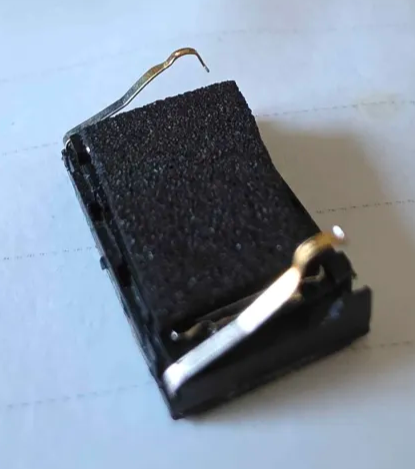

Maintenant que tous les composants sont disponibles, vous pouvez mettre de côté la coque arrière, les gâchettes et le haut-parleur d'origine : ils sont inutiles.

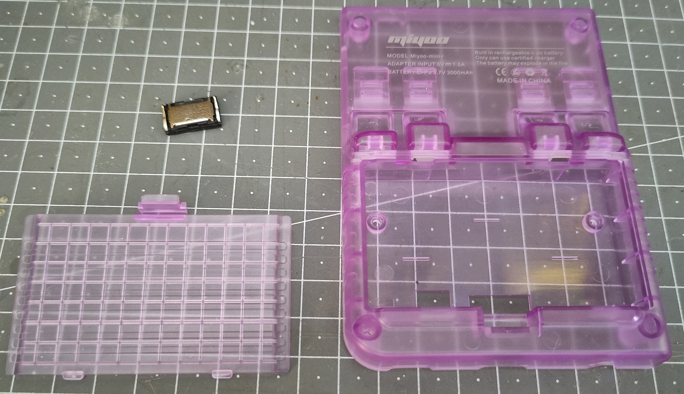

Avec des câbles d'approximativement 20 cm, effectuez une soudure sur le haut-parleur.

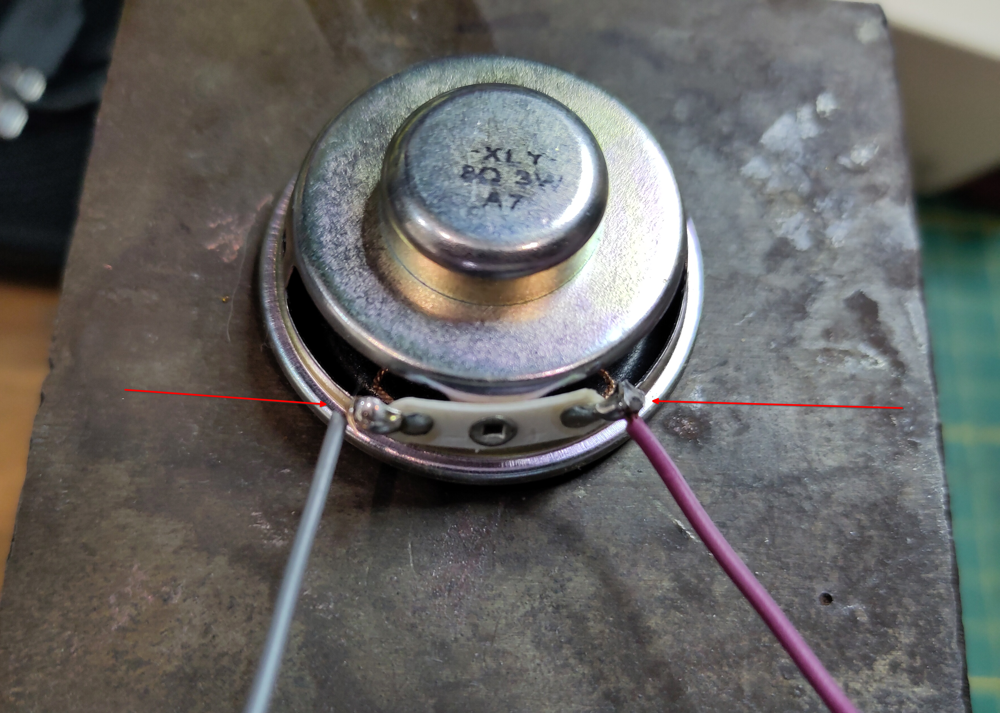

Puis, glissez les câbles dans le trou du haut-parleur de la Super Telmi. Astuce : vous pouvez loger un bout de mousse pour accueillir le haut-parleur ici, cela améliorera l'acoustique et la stabilité.

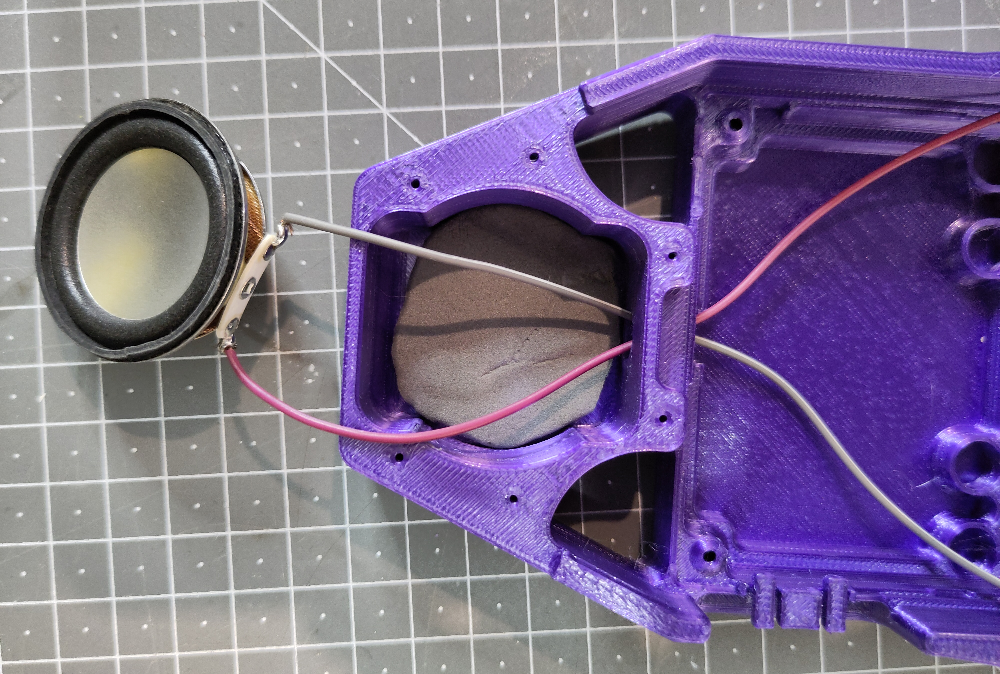

À présent, retournez délicatement la carte mère pour commencer la soudure sur les connecteurs du haut-parleur. Ils sont en bas à droite, indiqués « SPK1 ».

N'hésitez pas à faire un test audio en allumant la carte mère tout en maintenant une pression sur les surfaces de contact avant de souder. Pas d'inquiétude, la tension du périphérique est très faible, vous ne risquez rien.

> La polarité des connexions du haut-parleur n'a pas d'importance ici.

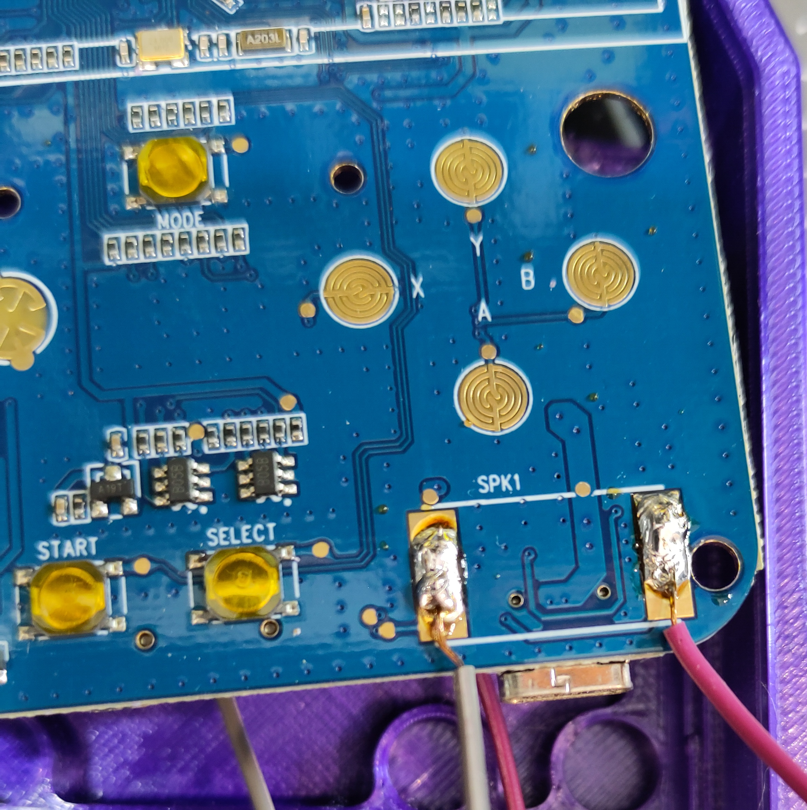

## Montage de la Super Telmi

Le haut-parleur est prêt, vous allez pouvoir positionner délicatement la carte mère dans le boîtier. Glissez les câbles du haut-parleur sur le bord de la Miyoo.
Vous pouvez utiliser un peu de ruban adhésif pour stabiliser le placement du câblage jusqu'au haut-parleur.

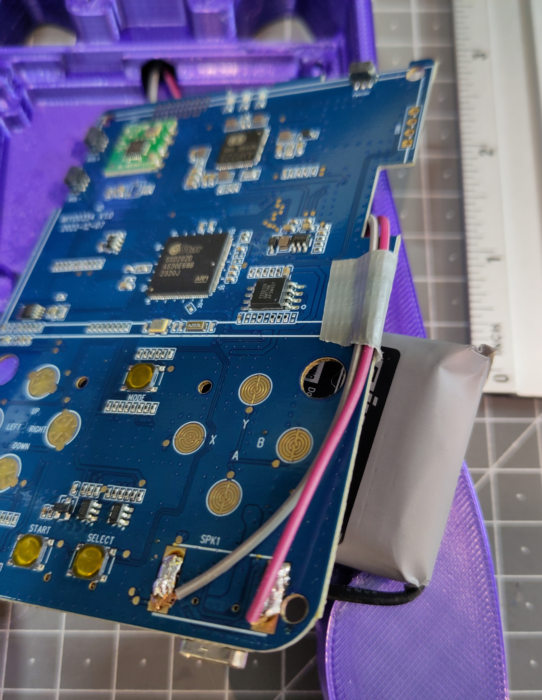

Une fois satisfait du montage du haut-parleur et du placement de la carte mère, remontez tranquillement tous les petits composants. Soyez délicat, cela demande de la patience. Les boutons sont particulièrement instables, soyez attentif.

Une bonne astuce est d'utiliser du ruban de masquage pour stabiliser tous les composants avant de commencer le montage.

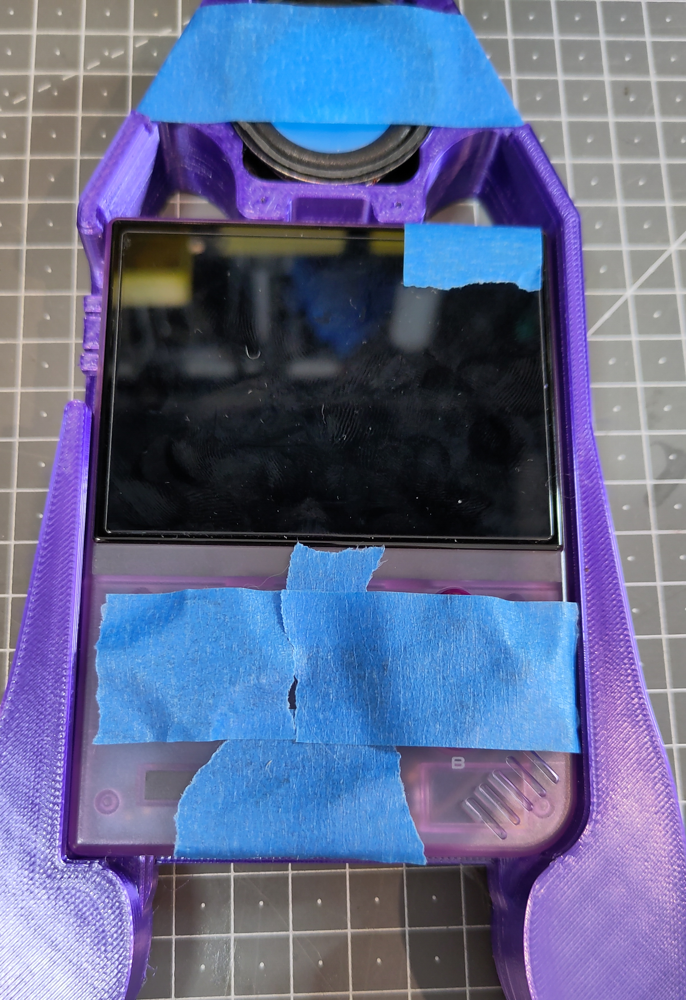

Tout est en place ? Positionnez la face arrière, maintenez-la, puis retournez la machine doucement.
Vous allez pouvoir réutiliser les vis d'origine pour procéder au serrage. Serrez en croix.

Enfin, fixez la façade pour le haut-parleur.

Testez tout ! Vous devriez avoir une Super Telmi prête à l'usage à ce stade.

Amusez-vous à personnaliser l'emplacement à l'arrière si vous le souhaitez, par exemple le prénom de l'enfant, vos coordonnées en cas de perte de l'appareil, etc. Il est possible d'éditer le texte directement dans votre slicer favori grâce au fichier 3MF.

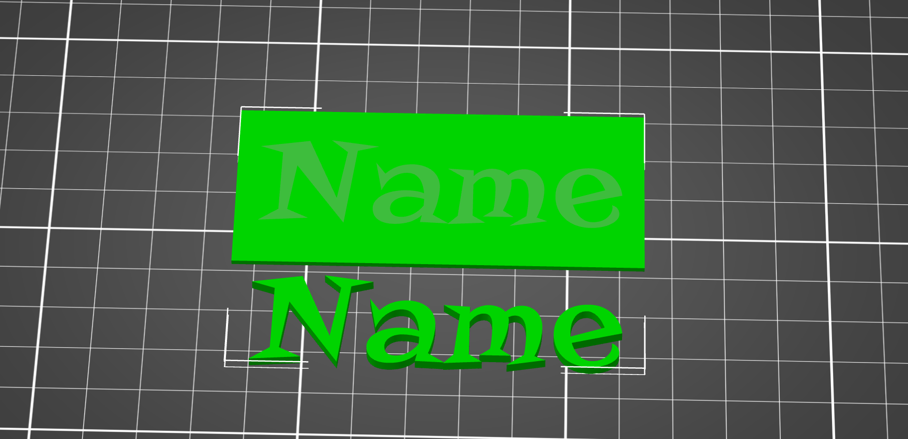

## Fabrication de la station d'accueil

Une fois votre station imprimée et nettoyée, vous pouvez appliquer une goutte (pas plus) de colle cyanoacrylate dans chaque trou prévu pour l'accueil des aimants néodyme.

> Vérifiez bien la polarité, le sens est important, avant de les sceller définitivement.

À présent, insérez un boulon M3 depuis l'arrière de la station dans le trou prévu à cet effet.

Ce dernier en place, insérez un petit collier de serrage autour, que vous pouvez pré-fermer en laissant juste assez d'ouverture pour passer la tête du câble USB-C et l'embout aimanté.

Une fois la position idéale bien mesurée avec la Super Telmi, serrez fermement le collier de serrage pour maintenir la position du câble et son embout aimanté définitivement en place.

Coupez l'excédent du collier avec une pince coupante, puis glissez le câble USB le long de la fente prévue à cet effet.

Félicitations, vous avez terminé la Super Telmi. Il ne reste plus qu'à emballer pour offrir 🎁
